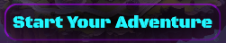
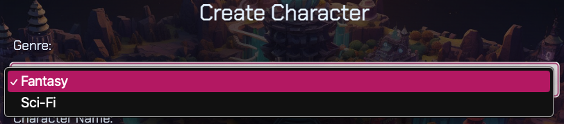
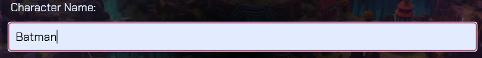
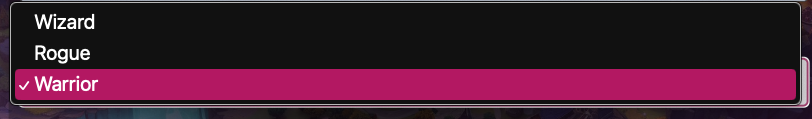
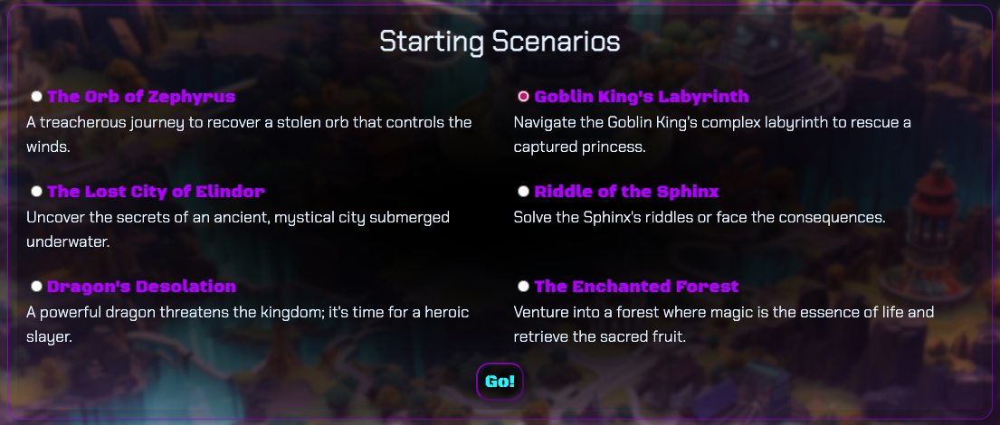

# Ready-Slayer-One
  
  

  > ## DESCRIPTION
  A role-playing game that uses OpenAI to generate stories based on the user's input. We grew up playing games such as Zelda and Final Fantasy, and wanted to develop a game with which you can take your own characters on unique journeys.

## TABLE OF CONTENTS
  1. [Description](#description)
  2. [Usage](#usage)
  3. [Contributing](#contributing)
  4. [Credits](#credits)
  5. [Tech](#tech)
  6. [License](#license)
  7. [References](#references)
  8. [Questions](#questions)

> ## USAGE
#### Go to our website  [Ready-Slayer-One](https://ready-slayer-one-725eabfb8585.herokuapp.com/)
#### Create an account or log in to be able to save your game, although you can play without an account.  
#### Click Ready-Slayer-One at the top at any time to go back to the homepage.  
#### To start a new game, click the "Start Adventure" button.  
#### Create your character by selecting a genre, entering your character's name, and selecting your character's class. Click the "Next" button.      
#### Select the scenario you're character will adventure into, then click "Go!".  
<!-- #### In the game screen, wait for the narrator to begin your story. Type any action for your character and take them on their journey. 

#### You can exit your story at any time by click "Ready-Slayer-One" to go to the homepage or "Profile" to go to your profile. TODO:Update image 

#### Your story will be saved to your profile if you are logged in. Delete stories as you wish. TODO:Update image  -->

> ## CONTRIBUTING
#### If you are interested in contributing to this project, please follow these steps:
- Fork the repo on GitHub
- Clone the project to your own machine
- Commit changes to your own branch
- Push your work back up to your fork
- Submit a pull request for review

> ## CREDITS
#### [Aidan Farina](https://github.com/Aidan-Farina)
#### [Jen Butler](https://github.com/justjenb)
#### [Kat Gorecki](https://github.com/SLAYsian)

> ## TECH
&nbsp;
&nbsp;
&nbsp;
&nbsp;
&nbsp;
&nbsp;
&nbsp;
&nbsp;
&nbsp;

> ## LICENSE
 
Please see the LICENSE file for details

> ## REFERENCES
- https://github.com/EBEREGIT/nodejs-chatgpt-tutorial
- https://github.com/Envoy-VC/awesome-badges
- https://shields.io/badges
- https://www.flaticon.com/
- UConn Coding Bootcamp - Module 14 MVC Mini Project

> ## QUESTIONS
For any questions, please reach out to the contributors, [Aidan Farina](https://github.com/Aidan-Farina) |
[Jen Butler](https://github.com/justjenb) | [Kat Gorecki](https://github.com/SLAYsian), via GitHub.